# Vertigo Games – Case Study

**The full detailed analysis, with both Turkish and English annotated explanations, can be found inside the Jupyter notebooks in the form of markdown documentation.**

Bu repo, Vertigo Games için hazırladığım case study çözümünü içerir.  
Çalışma iki ana kısımdan oluşuyor:

- **Task 1:** A/B test modelleme ve simülasyon
- **Task 2:** Kullanıcı verisi üzerinde keşifsel veri analizi (EDA) ve segmentasyon

---

## 1. Proje Yapısı

```text
vertigo_case_study/
├── data/          # Ham veri ve ara çıktı
├── notebooks/     # Analiz için Jupyter notebook'lar
├── src/           # Tekrar kullanılabilir Python modülleri
├── assets/        # Grafikler ve ekran görüntüleri
├── requirements.txt  # Gerekli Python paketleri
└── README.md

```

## Task 1 – A/B Test Simülasyonu

### 1. Deney Kurulumu

İki farklı zorluk akışını karşılaştırıyoruz: **Variant A** ve **Variant B**.  
Her bir varyant, 1. günden itibaren günde **20.000 install** alıyor.

Verilen metrikler:

| Metrik                | Variant A | Variant B |
|-----------------------|-----------|-----------|
| Günlük Purchase Oranı| 3.05%     | 3.15%     |
| eCPM                  | \$9.80    | \$10.80   |
| Ad Impression / DAU   | 2.3       | 1.6       |
| D1 Retention          | 53%       | 48%       |
| D3 Retention          | 27%       | 25%       |
| D7 Retention          | 17%       | 19%       |
| D14 Retention         | 6%        | 9%        |

**Ek monetizasyon varsayımı**

- Ortalama sepet/purchase tutarı (PPU) = **\$1.00(birim)**
- Not: 1 birimden fazla olmasi B varyansina yarar

Bu sayede tüm geliri **ARPDAU** (Average Revenue Per Daily Active User) cinsinden ifade edebiliyoruz:

- **Reklam ARPDAU’su**  
  `ARPDAU_ads = Impressions_per_DAU × eCPM / 1000`
- **IAP ARPDAU’su**  
  `ARPDAU_purchase = Purchase_Rate × PPU`

Sonuçta:

- **Variant A:** ≈ **\$0.0530** / DAU  
- **Variant B:** ≈ **\$0.0488** / DAU  

Yani A, aktif kullanıcı başına biraz daha iyi monetize ediyor; B ise purchase oranında hafif avantajlı.

---

### 2. Retention Modellemesi

Elimizde sadece **D1, D3, D7, D14** retention değerleri var.  
Ancak DAU ve gelir simülasyonu için **1–30. günler arası günlük retention** değerlerine ihtiyacımız var.

Gerçek oyuncu davranışı, genelde:

- İlk günlerde **sert bir düşüş**,  
- Sonrasında giderek **yavaşlayan bir kuyruk** pattern’i gösteriyor.

Bu yüzden lineer interpolasyon yerine, daha gerçekçi olan **eksponansiyel (exponential decay)** modeli kullandım.

Kullandığım formül:

\[
R(x) = C \cdot e^{-k(x-1)}
\]

- \(x\): oyuncunun yaşam gün sayısı (1, 2, 3, …)  
- \(R(x)\): x. günde aktif olma olasılığı,  
- \(C\): D1 retention değeri  
- \(k\): decay katsayısı

Her segment için (D1–D3, D3–D7, D7–D14), segmentin baş ve son noktalarından **segment bazlı bir \(k\)** hesaplayıp, bu sayede **1–30. günler için pürüzsüz ve monoton azalan** iki retention eğrisi elde ettim:

- **Variant A için günlük retention**: \(R_A(x)\)  
- **Variant B için günlük retention**: \(R_B(x)\)

---

### 3. DAU ve Gelirin Hesaplanması

Her gün için (d):

1. **DAU(d)**  
   O güne kadar alınmış tüm kohortlardan hayatta kalan kullanıcıları topluyorum:
   - Her günün kohortu, ilgili senaryoya göre `20.000` (veya yeni kaynak geldikten sonra 12k/8k) kullanıcı.
   - Yaş (age) = `d - cohort_day + 1`
   - Kullanıcıların o yaştaki aktif olma olasılığı = ilgili varyantın retention eğrisinden `R(age)`.

2. **Günlük gelir(d)**  
   `Revenue(d) = DAU(d) × ARPDAU_variant`

3. **Kümülatif gelir**  
   İlgili aralık için (örn. 1–15 veya 1–30)  
   `TotalRevenue = Σ Revenue(d)`
   

---

### Soru (a) ve (b) – 15. Günde DAU ve Toplam Gelir

**(a)** 15. günde hangi varyantın DAU’su daha yüksek?  
**(b)** 1–15. günler arasında hangi varyant daha çok gelir elde ediyor?

#### (a) 15. günde toplam DAU

15. günde, **1–15. günler arasında edinilen** 15 farklı kohortun hâlâ aktif olan kullanıcılarını topluyorum.

Sonuçlar:

- **Variant A – DAU(15) ≈ 54.624 kullanıcı**  
- **Variant B – DAU(15) ≈ 57.796 kullanıcı**

**Cevap (a): Variant B**  
B varyantı, özellikle orta vadede (D7–D14) daha güçlü retention’a sahip olduğu için 15. günde daha fazla aktif kullanıcıya ulaşıyor.


---

#### (b) 1–15. günler arası toplam gelir

Burada 1. günden 15. güne kadar **her günün DAU’su × ARPDAU** formülüyle günlük gelirleri hesaplayıp topluyorum.

Sonuçlar:

- **Variant A – Toplam gelir (D1–15): ≈ \$31,099.79**  
- **Variant B – Toplam gelir (D1–15): ≈ \$28,426.45**

**Cevap (b): Variant A**  
B’nin 15. gündeki DAU’su daha yüksek olsa da, **A varyantı kullanıcı başına daha iyi monetize ettiği için** ilk 15 günde toplamda daha fazla gelir üretiyor.

> Not: Bu sonuç **PPU = \$1** varsayımına bağlıdır.  
> PPU arttıkça B’nin daha yüksek purchase oranı daha önemli hale gelir ve belirli bir noktadan sonra B, geliri yakalayabilir hatta geçebilir.

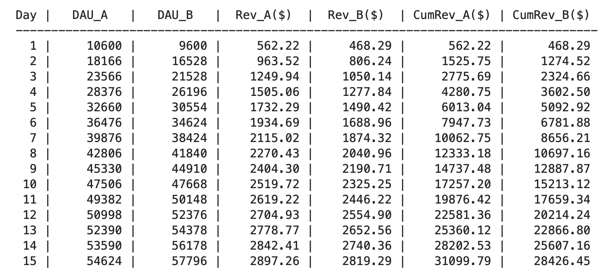
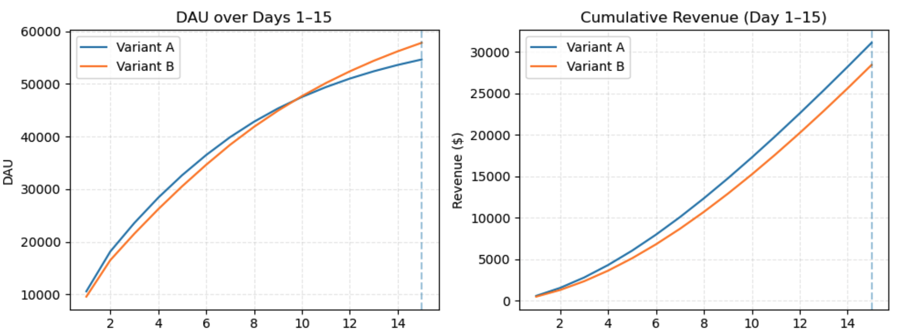

---

### Soru (c) – 30. Güne Kadar Toplam Gelir (Baz Senaryo)

**Soru:**  
> Eğer 15 yerine 30. güne kadar olan toplam gelire bakarsak, kazanan değişiyor mu?

Bu senaryoda hâlâ:

- Her varyant için günde **20.000 install**  
- **İndirim (sale) yok**  
- **Yeni user source yok**  
- ARPDAU sabit:
  - A: ≈ \$0.0530  
  - B: ≈ \$0.0488  

1–30. günler arasındaki simülasyon sonucunda:

- **Variant A – Toplam gelir (D1–30): ≈ \$77,786.13**  
- **Variant B – Toplam gelir (D1–30): ≈ \$76,257.09**

Fark:  
**A, B’ye göre ≈ \$1,529 daha fazla gelir elde ediyor.**

**Cevap (c): Kazanan değişmiyor, hâlâ Variant A.**  
Zaman penceresini 15’ten 30 güne genişlettiğimizde bile, toplam gelir açısından A varyantı önde kalıyor.

---

### Soru (d) – 10 Günlük Sale (15–24. Günler)

**Senaryo:**  
15. günde başlayan ve 24. günde biten **10 günlük bir indirim (sale)** yapıyoruz.  
Bu süre boyunca her iki varyantta da **purchase oranı +1 puan** artıyor:

- A: 3.05% → **4.05%**  
- B: 3.15% → **4.15%**

Retention değişmiyor, sadece bu 10 gün için **purchase gelirinde artış** var.

1–30. günler arasındaki yeni toplam gelir:

- **Variant A – Sale ile:** ≈ **\$83,532.10**  
- **Variant B – Sale ile:** ≈ **\$82,542.24**

Fark:  
**A, B’ye göre ≈ \$989.86 daha fazla gelir elde ediyor.**

**Cevap (d): 10 günlük sale sonrası da 30. güne kadar daha çok para kazanan yine Variant A.**  
Sale, her iki varyantın gelirini de artırıyor, B purchase oranı sebebiyle göreli olarak daha çok kazanıyor ama bu fark A’yı geçmeye yetmiyor.

---

### Soru (e) – 20. Günden İtibaren Yeni User Source

**Senaryo:**  
20. günden itibaren yeni bir user acquisition kaynağı ekliyoruz:

- **Eski kaynak (old source):**
  - 20. güne kadar: 20.000 kullanıcı/gün  
  - 20. günden sonra: **12.000 kullanıcı/gün**
  - Retention: baz senaryodaki A/B retention eğrileri (A_old, B_old)

- **Yeni kaynak (new source):**
  - 20. günden sonra: **8.000 kullanıcı/gün**
  - Retention fonksiyonları:
    - Variant A (new):
      \[
      R_A^{new}(x) = 0.58 \cdot e^{-0.12(x-1)}
      \]
    - Variant B (new):
      \[
      R_B^{new}(x) = 0.52 \cdot e^{-0.10(x-1)}
      \]

Monetizasyon tarafında hâlâ aynı ARPDAU’ları kullanıyoruz:

- A: ≈ \$0.0530  
- B: ≈ \$0.0488  

Her gün için:

- Eski kaynaktan gelen DAU (12k’lık kohortlar + önceki günler),  
- Yeni kaynaktan gelen DAU (8k’lık kohortlar, kendi retention fonksiyonları ile),  
toplanıp **Toplam DAU** hesaplanıyor. Ardından yine  
`Revenue(d) = Total_DAU(d) × ARPDAU` formülüyle gelir bulunuyor.

1–30. günler arasındaki toplam gelir:

- **Variant A – Yeni kaynakla:** ≈ **\$81,265.76**  
- **Variant B – Yeni kaynakla:** ≈ **\$79,123.35**

Fark:  
**A, B’ye göre ≈ \$2,142.41 daha fazla gelir elde ediyor.**

**Cevap (e): Yeni user source eklendiğinde de 30. güne kadar daha çok para kazanan Variant A.**  
Yeni kaynak, B için daha yavaş decay (daha iyi long-tail retention) sağlıyor, ancak ilk 30 gün içinde A’nın daha yüksek ARPDAU’su ve mevcut retention’ı toplam gelirde onu önde tutuyor.


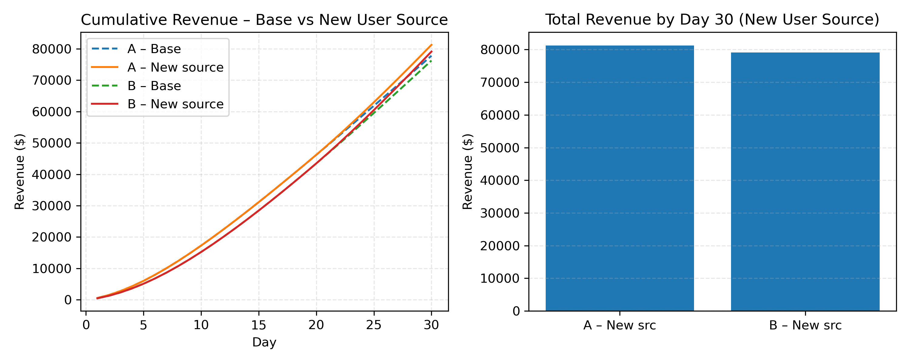
---

### Soru (f) – Sale vs Yeni User Source (Hangisini Önceliklendirmeliyiz?)

Bu noktada soru artık sadece A vs B seçimi değil, aynı zamanda bir **ürün stratejisi** sorusu:

> Eğer sadece **birini** yapabilecek olsaydık,  
> hangisi daha değerli olurdu?
> 1. 15–24. günler arasında 10 günlük sale  
> 2. 20. günden itibaren yeni ve kalıcı bir user source

Önce 30 günlük pencerede baz senaryo ile kıyaslayalım:

#### 30 Günlük Artış (Baz Senaryoya Göre)

- **10 günlük sale:**
  - A: baz ≈ \$77,786.13 → sale ≈ \$83,532.10 → **+ \$5,745.97**
  - B: baz ≈ \$76,257.09 → sale ≈ \$82,542.24 → **+ \$6,285.15**

- **Yeni user source:**
  - A: baz ≈ \$77,786.13 → new source ≈ \$81,265.76 → **+ \$3,479.63**
  - B: baz ≈ \$76,257.09 → new source ≈ \$79,123.35 → **+ \$2,866.26**

**Kısa vadede (ilk 30 gün):**

- **Sale**, yeni user source’a göre daha fazla ek gelir üretiyor.  
- Eğer hedef “bu ayın gelir hedefini tutturmak” ise → **sale daha iyi kaldıraç**.

**Uzun vadede (30 gün sonrası):**

- Sale, 10 gün sonra **tamamen bitiyor**, etkisi kalmıyor.  
- Yeni user source ise:
  - Her gün yeni kohortlar kazandırıyor,
  - İyi retention sayesinde **DAU’yu kalıcı olarak yukarı çekiyor**,
  - Gelir etkisi zamanla **bileşik (compound) şekilde artıyor**.


**Cevap (f):**

- **Sadece 30 güne bakıyorsam:** 10 günlük sale daha fazla ek gelir getiriyor → kısa vadeli kazanan: **Sale**.  
- **Gerçek ürün kararı veriyorsam (orta/uzun vadeli bakış):**  
  Kalıcı DAU ve gelir artışı sağladığı için **yeni user source’u** önceliklendiririm.

[Satis ve Yenikaynak](assets/task1_impact_sale_vs_new_source.png)


Kısaca:

> **Kısa vadede kazanan: A-Varyansi 30 gun icin -- sale boost.
> Uzun vadede kazanan: B-Varyansi -- yeni user source.**


## Task 2 – Kullanıcı Verisi Analizi (EDA & Segmentasyon)

### 1. Proje Tanımı ve Amaç

Bu bölümde amacım, mobil oyunda kullanıcıların oyun içi davranışlarını analiz ederek:

- Kullanıcıların **oyunla etkileşim seviyelerini**,
- **Kalıcılık (retention)** dinamiklerini,
- **Harcama (monetizasyon)** davranışlarını,
- **Teknik hataların (server_connection_error)** oyuncu deneyimi ve gelir üzerindeki etkisini

anlamak ve bu içgörülerle ürün geliştirme, kullanıcı tutma ve gelir artırma stratejilerine temel oluşturmak.

Temel sorular:

- Oyuncular oyunu nasıl oynuyor ve hangi davranışsal segmentlere ayrılabiliyor?
- Hangi kullanıcı tipleri daha yüksek retention gösteriyor?
- Hangi kullanıcı profili daha fazla gelir üretiyor (IAP + Ads)?
- iOS vs Android davranış ve gelir farkları neler?
- Ülkelere göre kullanıcı değeri ve hata seviyeleri nasıl değişiyor?
- Bağlantı/teknik hatalar engagement ve monetizasyonu nasıl etkiliyor?

---

### 2. Veri Seti ve Hazırlık

Veri seti, her kullanıcı için **günlük** bazda özet oyun içi aktiviteleri içeriyor. Başlıca alanlar:

- Kimlik & zaman: `user_id`, `event_date`, `install_date`, `platform`, `country`
- Kullanım: `total_session_count`, `total_session_duration`
- Oyun aksiyonları: `match_start_count`, `match_end_count`, `victory_count`, `defeat_count`, `server_connection_error`
- Gelir: `iap_revenue`, `ad_revenue`

**Hazırlık adımları:**

- `event_date` ve `install_date` kolonları `datetime` tipine dönüştürüldü.
- **Eksik veriler:**
  - `country` sütunundaki eksikler oranı ≈ **%0.25** olduğu için silmek yerine `"Unknown"` ile dolduruldu.
  - Sayaç ve gelir kolonlarındaki eksikler (`*_count`, `*_revenue`) **0** ile dolduruldu.
- Kullanıcı bazlı analiz için:
  - Günlük kayıtlar **user-level** seviyesinde agregate edildi.
  - Her kullanıcı için:
    - `days_played`, `total_sessions`, `total_duration`,
    - `total_matches_started`, `total_matches_ended`, `total_wins`, `total_losses`,
    - `total_iap`, `total_ads`, `total_revenue = total_iap + total_ads`
    hesaplandı.
- Veri kalitesi kontrolleri:
  - Negatif süre, 0’a bölme vb. hatalar kontrol edildi.
  - Türetilmiş metriklerde oluşan `NaN` değerler güvenli şekilde **0** ile normalize edildi.

Bu adımların sonunda, **kullanıcı bazlı temiz ve zengin bir dataset** elde edildi.

---

### 3. Türetilmiş Metrikler ve Davranış Modeli

Kullanıcı davranışını daha iyi anlatmak için şu metrikleri türettim:

- **Kullanım & yoğunluk**
  - `sessions_per_day` = `total_sessions / days_played`
  - `avg_session_duration` = `total_duration / total_sessions`
  - `play_intensity` = `total_duration / days_played` (sn/gün)

- **Maç ve performans**
  - `match_intensity` = `total_matches_started / days_played`
  - `win_rate` = `total_wins / (total_wins + total_losses)`
  - `completion_rate` = `total_matches_ended / total_matches_started`

- **Teknik kalite**
  - `error_rate` = `server_connection_error / total_matches_started`

- **Monetizasyon**
  - `total_revenue` = `iap_revenue + ad_revenue`
  - `revenue_per_session` = `total_revenue / total_sessions`

Bu metrikler, tekil kullanıcıyı sadece “kaç gün oynadı?” perspektifinden çıkarıp, **çok boyutlu bir davranış ve değer profiline** dönüştürüyor.

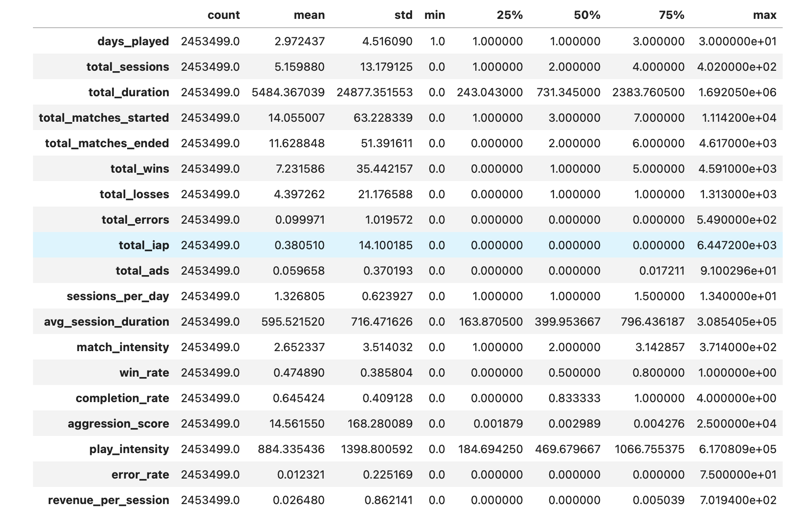
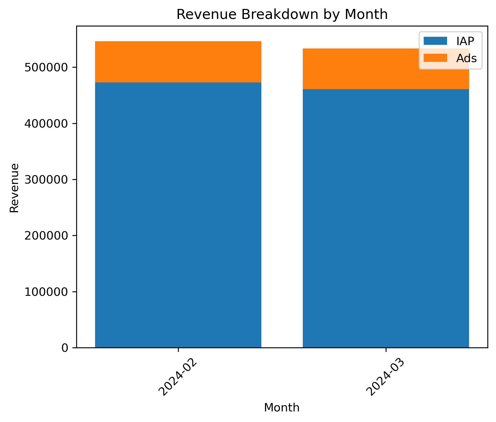
---

### 4. Segmentasyon Yaklaşımı

Analizde iki katmanlı bir segmentasyon kullandım:

#### 4.1. Engagement Segmentleri (Light / Medium / Heavy)

İlk olarak, oyuncuları **etkileşim yoğunluğuna göre** 3 segmente ayırdım (örneğin ilk gün maç sayısı / toplam maç + süre):

- **Light**  
  - Az gün oynayan, kısa süreli, düşük maç sayılı kullanıcılar.
- **Medium**  
  - Orta düzeyde gün sayısı, süre ve maç hacmine sahip oyuncular.
- **Heavy**  
  - Çok gün oynayan, uzun süre kalan, maç başına yüksek hacimli ve genelde daha iyi performans sergileyen kullanıcılar.
  
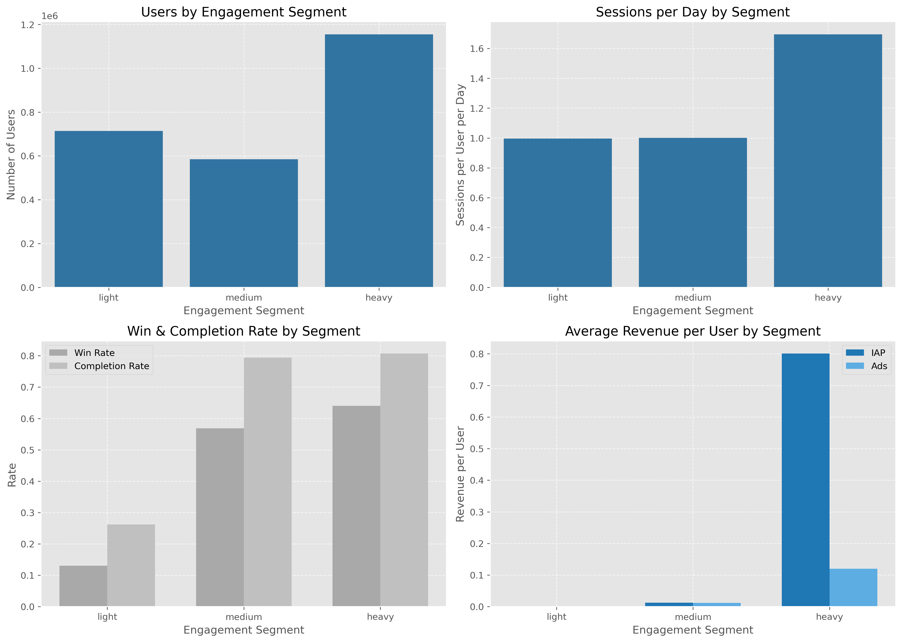

Özet gözlemler:

- Heavy segment:
  - En yüksek **days_played**, **play_intensity**, **matches_per_session**, **win_rate** ve **completion_rate** değerlerine sahip.
  - Gelirin çok önemli bir kısmı bu kullanıcı grubundan geliyor.
- Light segment:
  - Genellikle 1–2 gün oynayan, az maç yapan, düşük kazanma ve tamamlama oranına sahip ve neredeyse hiç gelir üretmeyen kitle.

#### 4.2. K-means Cluster Analizi (Davranış + Monetizasyon)

İkinci adımda, türetilmiş metrikleri kullanarak K-means ile 4 ana cluster çıkardım. Kısa özet:

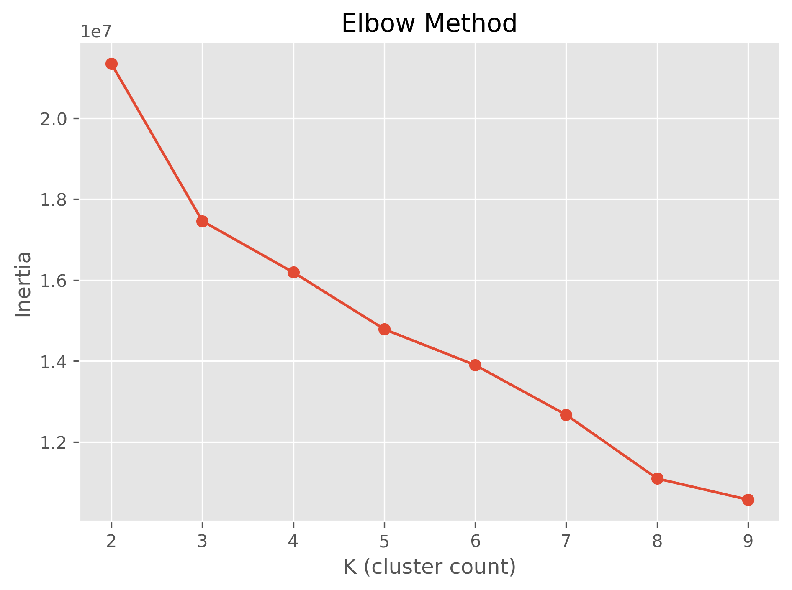

- **Cluster 3 – VIP / Whale segmenti**
  - Çok küçük kullanıcı sayısı, ama **kişi başı çok yüksek gelir (revenue_per_user ~ 1000+)**.
  - Genelde uzun süre oynayıp geç dönemde yüksek tutarda IAP yapan kullanıcılar.

- **Cluster 0 – Heavy spender çekirdek**
  - Görece az kullanıcı, yüksek toplam gelir ve kişi başı ~3+ gelir.
  - Hem engagement hem monetizasyon anlamında oyunun ana taşıyıcı segmenti.

- **Cluster 2 – Geniş F2P çekirdeği**
  - Çok büyük kullanıcı kitlesi, kişi başı düşük gelir.
  - Gelecekte payere dönüşebilecek, soft-monetization ve düşük bariyerli ürünlerle hedeflenebilecek segment.

- **Cluster 1 – Düşük engagement / düşük gelir kitlesi**
  - Çok sayıda kullanıcı, çok düşük engagement ve neredeyse sıfır gelir.
  - Onboarding ve ilk gün deneyimi açısından iyileştirme alanı.
  

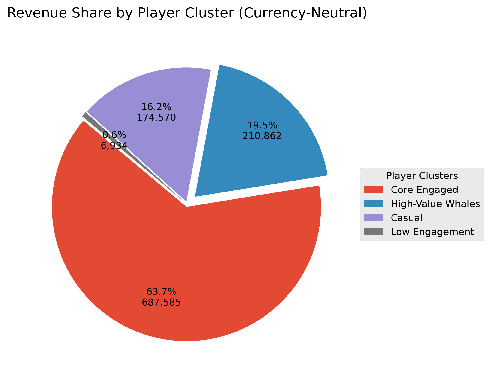
---

### 5. Monetizasyon Özeti

Genel monetizasyon metrikleri (örnek):

- **Payer rate** ≈ **%1.4**  
- **ARPU** ≈ **0.44**  
- **ARPPU** ≈ **30+**  
- Gelirin ~**%85+**’i IAP, ~**%15**’i Ads kaynaklı.

Bu yapı, klasik F2P ekonomisini doğruluyor:

- Çok geniş bir **non-payer** kitlesi,
- Çok küçük ama çok değerli bir **payer / whale** kitlesi,
- Gelirin büyük bölümü bu small segment üzerinden geliyor.

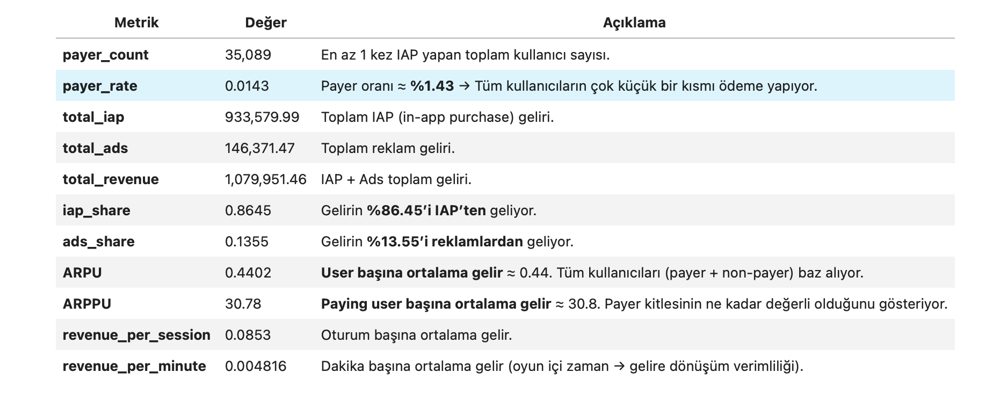
---

### 6. Time to First Payment (TTFP)

Payer’lar için **install → ilk ödeme** arasındaki süreyi (gün cinsinden) analiz ettim.

- Tüm payer’lar için:
  - **Median TTFP ≈ 37 gün** (yarısı ilk ~1 ay içinde ödeme yapıyor),
  - Uzun kuyruk (outlier’lar) sebebiyle mean çok daha yüksek çıkıyor (190+ gün).

Cluster bazında median TTFP özet:

- Cluster 0: ~34 gün → Erken dönemde payere dönüşen **heavy spender**’lar.
- Cluster 2: ~41 gün → 1–2 ay içinde dönüştürülebilen geniş F2P çekirdeği.
- Cluster 3: ~66+ gün → Uzun süre free oynayıp sonradan büyük harcama yapan **VIP/whale** kitlesi.
- Cluster 1: ~200+ gün → Neredeyse hiç monetize olmayan düşük engagement grubu.

**Yorum:**  
Oyun, “ilk günden para iste” yerine **“önce uzun vadeli engagement, sonra monetizasyon”** modeline daha yakın duruyor. En değerli oyuncular genelde:

- Uzun süre oyunda kalıyor,
- İlerleme / rekabet / sosyal bağ kurduktan sonra,
- Mid/late game’de yüksek ticket harcamaya başlıyor.

---

### 7. Funnel Analizi – Install → Session → Match → Payer

Basit funnel özet:

- **Install → Session ≈ %99.9**  
  - Oyunu indirenlerin neredeyse hepsi en az bir kez açıyor.
- **Session → Match ≈ %82**  
  - Oyunu açanların büyük kısmı en az bir maç oynuyor; ~%18 civarı, maça geçmeden ayrılıyor.
  - Kritik kırılma noktası: **ilk maç öncesi deneyim** (onboarding, menü, yükleme, teknik sorunlar).
- **Match → Payer ≈ %1.4**  
  - Çok geniş oyuncu tabanına rağmen küçük bir kısmı payere dönüşüyor.

Bu funnel, stratejik olarak:

- İlk maç deneyimini iyileştirme,
- Early-game retention,
- Mid/late game’de monetizasyon kaldıraçlarını güçlendirme

alanlarının en çok etki edecek noktalar olduğunu gösteriyor.

---

### 8. Ülke ve Platform Bazlı İçgörüler

#### 8.1. Ülkelere Göre Değer ve Hata

Özet gözlemler:

- **ABD**  
  - Yüksek ARPU ve yüksek payer rate ile en değerli pazarlardan biri.
- **Türkiye**  
  - Çok yüksek **days_played** ve güçlü ARPU/payer rate ile yüksek potansiyelli çekirdek pazar; error rate düşük.
- **Brezilya**  
  - En büyük kullanıcı tabanına ve yüksek toplam gelire sahip pazar; error oranı orta seviyede.
- **Vietnam**  
  - Küçük ama verimli, düşük hata oranlı ve makul ARPU’lu pazar.
- **Rusya / Ukrayna / Meksika / Kazakistan**  
  - Hata oranı yüksek; bazıları anlamlı revenue share’e sahip (özellikle Rusya, Ukrayna).  
  - Bu ülkelerde teknik iyileştirme → direkt retention ve gelir artışı potansiyeli.
  
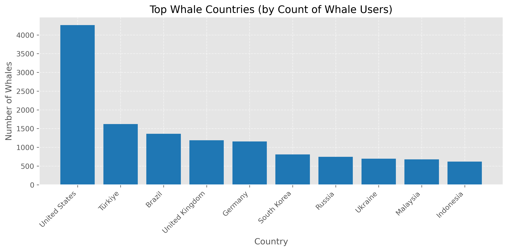
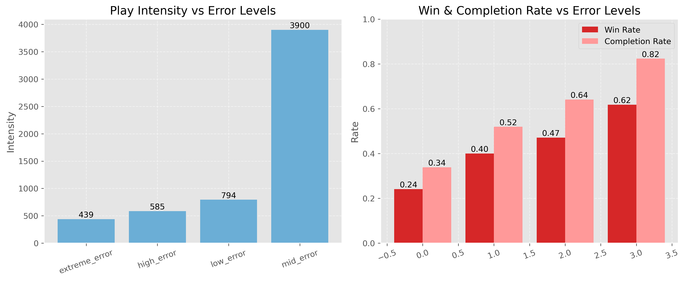
#### 8.2. Platform (iOS vs Android)

- **iOS**
  - Whale oranı Android’e göre yaklaşık 2 kat daha yüksek.
  - Error rate daha düşük → daha stabil ve daha değerli kullanıcı tabanı.

- **Android**
  - Kullanıcı hacmi yüksek, whale oranı ve monetizasyon görece düşük.
  - Error rate daha yüksek; cihaz çeşitliliği ve bağlantı sorunları etkili olabilir.

---

### 9. Hata (Error) Segmentleri ve Deneyim

Kullanıcıları error_rate’e göre segmentlediğimde:

- **mid_error**  
  - En yüksek days_played, play_intensity ve revenue_per_user →  
    Biraz hata görseler de oyunda kalan **heavy/core** oyuncular.
- **low_error**  
  - Ana F2P kitle; orta seviye engagement, düşük gelir.
- **high_error & extreme_error**  
  - Düşük performans, düşük completion, çok hata, neredeyse sıfır gelir.  
  - Özellikle **extreme_error** segmenti, hem engagement hem potansiyel gelir açısından tamamen kaybedilen oyuncu grubu.

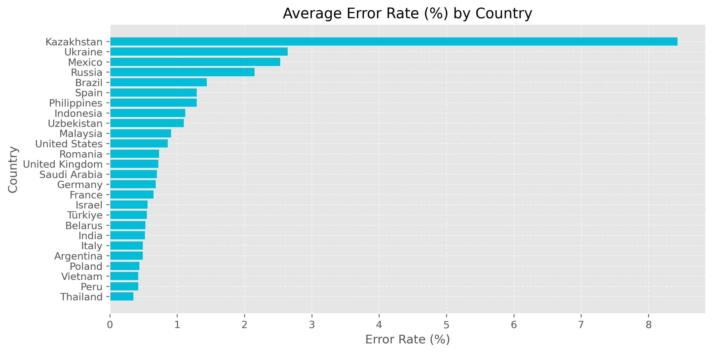

Bu, **aşırı hata yaşayan kullanıcıların monetize olmadan churn ettiklerini** net biçimde gösteriyor.

---

### 10. Özet ve Öneriler

- Oyuncu tabanı, klasik F2P yapısına benzer şekilde:
  - **Çok geniş bir low-engagement F2P kitlesi**,  
  - **Küçük ama çok değerli bir heavy/whale kitlesi** şeklinde piramit oluşturuyor.
- Monetizasyon modeli “önce tut, sonra monetize et” yaklaşımına yakın:
  - Uzun vadeli engagement ve ilerleme hissi →  
    VIP/whale segmentinde yüksek ARPPU ve geç TTFP.

**Öneri başlıkları:**

- **Onboarding & ilk maç deneyimi**  
  - Session → Match drop-off’unu azaltmak için tutorial, ilk maç öncesi UX ve teknik stabiliteyi iyileştirmek.
- **Heavy & whale segmentini koruma**  
  - Late-game içerik, rekabetçi modlar, sosyal sistemler ve VIP tekliflerle bu kitleyi elde tutmak.
- **Geniş F2P çekirdeğini monetize etme**  
  - Düşük bariyerli ilk satın alma paketleri, region-based pricing, soft offers.
- **Teknik stabilite yatırımı**  
  - Özellikle hata oranı yüksek ama gelir potansiyeli olan ülke ve platform kombinasyonlarında (örneğin bazı Android + ülke kombinasyonları).
- **Bölgesel strateji**  
  - ABD ve Türkiye gibi yüksek ARPU pazarlarında live-ops ve kişiselleştirilmiş kampanyalar,
  - Brezilya ve gelişmekte olan pazarlarda fiyatlandırma ve lokal teklifler.
  

**The full detailed analysis, with both Turkish and English annotated explanations, can be found inside the Jupyter notebooks in the form of markdown documentation.**

## How to run

```bash
git clone <repo-url>
cd vertigo_case_study
pip install -r requirements.txt

# Jupyter
jupyter lab
# Then open notebooks/1_task1_ab_test.ipynb and notebooks/tas2_user_segmentation.ipynb

